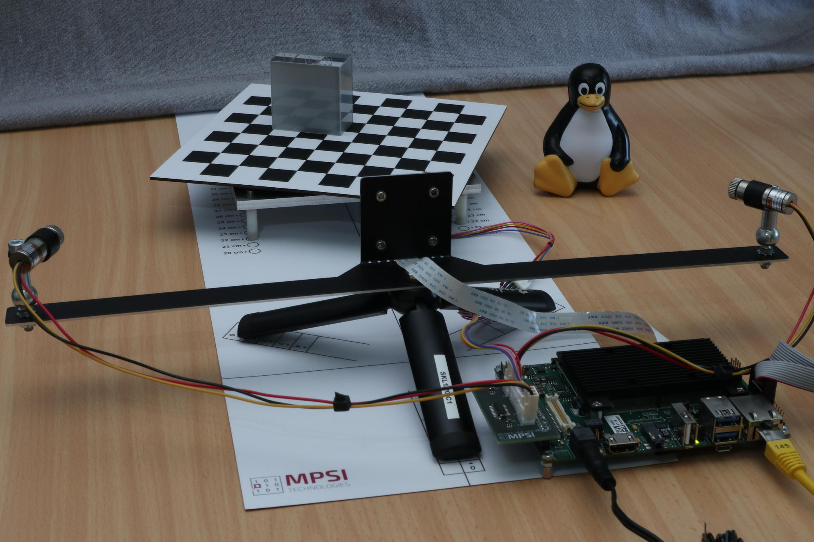

# Whiznium StarterKit

Embedded Software without a nice piece of hardware makes no sense. The Whiznium StarterKit is a tabletop 3D laser scanner, built from affordable components, with all project information Open Sourced.

This repository holds the Whiznium StarterKit WhizniumSBE-backed project (Embedded Linux daemon).

## Resources for now

- A [.pdf flyer](https://mpsitech-public.s3.eu-central-1.amazonaws.com/starterkit.pdf) stating the basic facts of the FPGA and non-FPGA versions 
- A [YouTube video](https://youtu.be/4ciw7BDYv2Q) showing the tabletop 3D laser scanner in action

## Upcoming documentation

- The Whiznium book (draft available [here](https://mpsitech-public.s3.eu-central-1.amazonaws.com/book.pdf)), including a code walkthrough and description of major WhizniumSBE/DBE concepts using the StarterKit as a handy use case

## Related Repositories

- [Whiznium StarterKit Device](https://github.com/mpsitech/wskd-Whiznium-StarterKit-Device), the RTL counterpart for the FPGA-based implementations of the tabletop 3D laser scanner

## Contact

The Whiznium StarterKit is developed and offered as an affordable starting point to the vast set of WhizniumSBE/DBE features by Munich-based start-up [MPSI Technologies GmbH](https://www.mpsitech.com). Feel free to [contact us](mailto:contact@mpsitech.com) with any questions.
